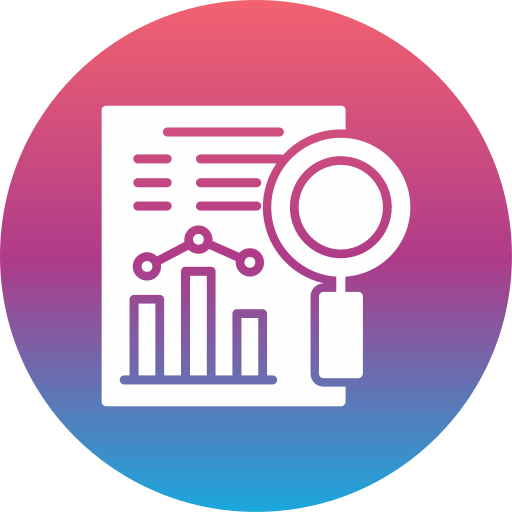

# Worldwide COVID-19 Statistics 
## INFO 201 "Foundational Skills for Data Science" — Spring 2022

Authors: Haochen Hu (haochh3@uw.edu), Eason Lin (yichl42@uw.edu), Shammu Meyyappan (shammu53@uw.edu), Vincent Chen (vjc6600@uw.edu)

Link to our Shiny App: https://haochenhu.shinyapps.io/final-project-mctisy/

# Introduction

### The importance

Our main question is regarding the relationship between outbreak and reduction over time.

We are concerned with all the various outbreaks of COVID-19 and the patterns of reduction of after such outbreaks.

Considering that COVID-19 is widespread and harms people's health, this is important because analyzing and understanding the reasons and patterns behinds these outbreaks can help protect people in the future.

Accordingly, we plan to record the data and analyze it, and we hope that we can aid the government and general population in making decisions going forward.

### Main questions we are seeking to answer

- Is there a relationship between specific parts of the world and COVID-19 deaths?

- When are variants most likely to occur?

- After the each COVID-19 outbreak, when did the daily new cases start to reduce and rebound?

- Is the timing of COVID-19 outbreaks related to the seasons and times of the year?

- Which countries did the best in preventing COVID-19 in the past, what was the pattern and what can we learn from it? 

### The dataset we are using

We use the dataset named Covid-19 Global Dataset from kaggle, and here is the link: <https://www.kaggle.com/datasets/josephassaker/covid19-global-dataset>. Kaggle is an online community which allows users to find and publish data sets and allow scientists to explorer data, work with other data scientists to solve data science challenges. 

Our dataset was scraped by Joseph Assaker, an artificial intelligence engineer from Lebanon, on March 17, 2022 from [Worldometer](https://www.worldometers.info/coronavirus/), a trusted live-tracker of coronavirus data through official government reports so our data is authoritative.

We want to do research on the relationships between COVID-19 outbreaks and both the seasons of the year and different parts of the world. This dataset include all the statistics we want, so it best fits our project.

The data was collected in an attempt to more easily monitor and predict future trends regarding COVID-19, both on a worldwide scale and within specific countries. 

### Ethical questions and limitations 

Seeing that this is a global dataset, one of the major limitations is the accuracy of the dataset. With countries like North Korea who tend to not give out information about their country, how can we be sure that we have accurate information from them or any other country. Countries could potentially lower their count to show that it is safe instead of suffering major economic setbacks. 

Generalizing this dataset by describing it as “global” seems far-fetched due to the fact that many countries may not want to share their data. Additionally, this dataset doesn’t show the many external variables that create different results within different countries. Knowing these third party variables could further explain what is going on within the country. This also leads me

# Conclusion / Summary Takeaways

### Takeaway #1 

As you can see from the COVID-19 stats by continent, Africa and
    Australia/Oceania were affected by COVID-19 the least. They had the least
    deaths, confirmed cases, critical cases, and active cashes. On the other
    hand, South America and Europe were affected the most by having the most
    deaths, active cases, confirmed cases, and critical cases. With each feature
    you can predict insights that could potentially explain what was going on
    with each country. For example, the high active cases within Europe could
    indicate that there were not enough regulations and traveling restrictions.
    Meanwhile, a high total death count and critical personnel in South America
    could show a lack of medical attention or technological advancements.

### Takeaway #2

Upon observing various countries through the COVID-19 cases tracker,
    a clear pattern emerges of many countries' largest spike in daily new
    cases occuring around the end of 2021 and beginning of 2022--the height
    of the Omicron variant. This can be seen across many countries, for
    instance in Slovenia, daily new cases never eclipsed 5000 until the
    Omicron variant in early 2022, when they surpassed even 20000 daily new
    cases. Monitoring the trends of when these spikes occur can allow us to
    detect new variants of the disease, like Omicron, and further understand
    what causes COVID-19 to spread faster--ultimately allowing us to stay
    better protected and work towards a post-COVID world.

### Takeaway #3

From the chart, it is quite clear to see that the inflection points and the
    trends of the epidemic situation in each country are not exactly the same. To be
    more specific, China and Germany both reached the peak in December (about 113 and 71887),
    while Japan reached the peak in September (about 18797). The daily change in the UK
    is relatively more complex: it experienced a sharp drop from January to February, but
    rebounded from July and reached the peak in December as well. Among them, the number of
    daily increase cases in the United States is much higher than that in other countries
    (even larger than the sum). The most important insight from my analysis is China's 'case
    cleraing' epidemic prevention policy makes their overall cases and daily new increase far
    lower than that of other countries. When we point to other countries, all points in China
    seem to be on the coordinate axis. Therefore, China deserves to be called 'the safest
    epidemic situation in the world at present'. Once we check the USA, the points of other
    countries are all below the US and there is a large difference between them. With those
    in mind, we can also explain this relative amount through different epidemic policies
    in those countries. For the broader implications of this chart, I would say I chose to
    study these five countries since they are the world's top five economies and the conclusions
    drawn from them is fairly applicable to other countries.